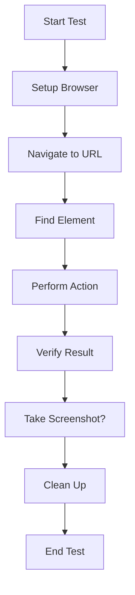
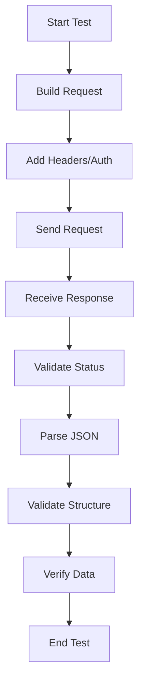
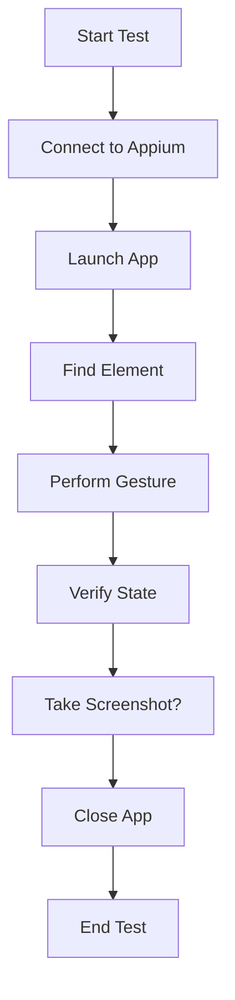

# Architecture Overview

> **Understanding how the testing framework works**

This document explains the architecture and design principles of the simple testing framework, helping you understand how to extend and customize it for your needs.

## 📋 Overview

The testing framework is built with a **modular, layered architecture** that allows you to:
- Pick and choose the components you need
- Easily extend functionality
- Swap out implementations
- Maintain clean separation of concerns

## 🏗️ Architecture Layers

```
┌─────────────────────────────────────┐
│           Test Layer                │  <- Your test scripts
├─────────────────────────────────────┤
│         Framework Layer             │  <- WebDriver, Appium, Requests
├─────────────────────────────────────┤
│        Driver Layer                 │  <- Browser drivers, mobile drivers
├─────────────────────────────────────┤
│        Platform Layer               │  <- Chrome, Firefox, Android, iOS
└─────────────────────────────────────┘
```

### Layer Descriptions

**Test Layer**
- Your test cases and test logic
- Test data and test scenarios
- Assertions and verifications

**Framework Layer**
- Selenium WebDriver for web testing
- Appium for mobile testing
- Requests library for API testing

**Driver Layer**
- ChromeDriver, GeckoDriver, etc.
- Android drivers
- iOS drivers

**Platform Layer**
- Browser engines
- Operating systems
- Mobile platforms

## 🔧 Core Components

### 1. Web Testing Components

```
Web Testing
├── WebDriver Manager        # Automatic driver management
├── Browser Configuration    # Browser setup and options
├── Element Locators         # Finding web elements
├── Action Handlers          # Clicking, typing, scrolling
└── Wait Mechanisms          # Explicit and implicit waits
```

**Key Classes:**

```python
# Browser Setup
class BrowserManager:
    """Manages browser creation and configuration"""
    def __init__(self):
        self.driver = None
    
    def get_driver(self, browser_type="chrome", headless=False):
        """Create and configure browser driver"""
        
# Element Handling
class ElementHandler:
    """Handles element location and interaction"""
    def find_element(self, by, locator):
        """Find single element"""
    
    def find_elements(self, by, locator):
        """Find multiple elements"""
    
    def click_element(self, element):
        """Click element"""
    
    def send_keys(self, element, text):
        """Type text into element"""
```

### 2. API Testing Components

```
API Testing
├── Request Builder          # Build HTTP requests
├── Response Handler         # Process responses
├── Authentication Manager   # Handle auth tokens
├── Validation Engine        # Validate responses
└── Session Manager          # Manage request sessions
```

**Key Classes:**

```python
# API Client
class APIClient:
    """Main API testing interface"""
    def __init__(self, base_url, auth=None):
        self.base_url = base_url
        self.session = requests.Session()
        if auth:
            self.session.auth = auth
    
    def get(self, endpoint, params=None):
        """GET request"""
    
    def post(self, endpoint, data=None, json=None):
        """POST request"""
    
    def put(self, endpoint, data=None, json=None):
        """PUT request"""
    
    def delete(self, endpoint):
        """DELETE request"""

# Response Validator
class ResponseValidator:
    """Validates API responses"""
    def validate_status_code(self, response, expected_codes):
        """Validate HTTP status code"""
    
    def validate_json_structure(self, response, required_fields):
        """Validate JSON structure"""
    
    def validate_content_type(self, response, expected_type):
        """Validate content type"""
```

### 3. Mobile Testing Components

```
Mobile Testing
├── Driver Factory           # Create platform drivers
├── Device Manager          # Manage device connections
├── Gesture Handler         # Handle touch gestures
├── App Manager            # Manage app lifecycle
└── Element Locator        # Find mobile elements
```

**Key Classes:**

```python
# Mobile Driver
class MobileDriver:
    """Mobile testing driver"""
    def __init__(self, platform="android"):
        self.platform = platform
        self.driver = None
    
    def create_driver(self, capabilities):
        """Create mobile driver"""
    
    def connect(self, host="localhost", port=4723):
        """Connect to Appium server"""

# Gesture Handler
class GestureHandler:
    """Handle mobile gestures"""
    def tap(self, coordinates_or_element):
        """Tap gesture"""
    
    def swipe(self, start_x, start_y, end_x, end_y, duration):
        """Swipe gesture"""
    
    def pinch(self, element, scale):
        """Pinch gesture"""
    
    def rotate(self, element, angle):
        """Rotate gesture"""
```

### 4. Data-Driven Components

```
Data-Driven Testing
├── Data Provider           # Load test data
├── Data Validator          # Validate data
├── Test Executor           # Execute parameterized tests
├── Data Generator          # Generate synthetic data
└── Result Collector        # Collect and organize results
```

## 🔄 Test Execution Flow

### Web Test Execution Flow



**Step-by-Step Flow:**

1. **Setup Phase**
   - Initialize browser driver
   - Configure browser options
   - Set up implicit waits

2. **Navigation Phase**
   - Load web page
   - Wait for page to load
   - Verify page loaded successfully

3. **Interaction Phase**
   - Locate target elements
   - Perform actions (click, type, scroll)
   - Handle dynamic content with waits

4. **Verification Phase**
   - Check assertions
   - Verify expected results
   - Capture evidence (screenshots)

5. **Cleanup Phase**
   - Close browser
   - Clean up resources
   - Generate reports

### API Test Execution Flow



### Mobile Test Execution Flow



## 🛠️ Design Patterns

### 1. Page Object Model (POM)

**For Web Testing:**

```python
# Base page with common functionality
class BasePage:
    def __init__(self, driver):
        self.driver = driver
        self.wait = WebDriverWait(driver, 10)
    
    def find_element(self, by, locator):
        return self.wait.until(
            EC.presence_of_element_located((by, locator))
        )
    
    def click(self, by, locator):
        element = self.find_element(by, locator)
        element.click()
    
    def type(self, by, locator, text):
        element = self.find_element(by, locator)
        element.clear()
        element.send_keys(text)

# Specific page implementation
class LoginPage(BasePage):
    # Locators
    USERNAME_FIELD = (By.ID, "username")
    PASSWORD_FIELD = (By.ID, "password")
    LOGIN_BUTTON = (By.ID, "login")
    
    def __init__(self, driver):
        super().__init__(driver)
    
    def login(self, username, password):
        self.type(*self.USERNAME_FIELD, username)
        self.type(*self.PASSWORD_FIELD, password)
        self.click(*self.LOGIN_BUTTON)
    
    def is_login_successful(self):
        try:
            self.wait.until(
                EC.url_contains("dashboard")
            )
            return True
        except:
            return False
```

### 2. Factory Pattern

**For Driver Creation:**

```python
class DriverFactory:
    """Factory for creating different types of drivers"""
    
    @staticmethod
    def create_web_driver(browser="chrome", headless=False):
        """Create web driver"""
        if browser.lower() == "chrome":
            return ChromeDriver(headless).get_driver()
        elif browser.lower() == "firefox":
            return FirefoxDriver(headless).get_driver()
        else:
            raise ValueError(f"Unsupported browser: {browser}")
    
    @staticmethod
    def create_mobile_driver(platform="android", device_name="emulator"):
        """Create mobile driver"""
        if platform.lower() == "android":
            return AndroidDriver(device_name).get_driver()
        elif platform.lower() == "ios":
            return iOSDriver(device_name).get_driver()
        else:
            raise ValueError(f"Unsupported platform: {platform}")

# Usage
web_driver = DriverFactory.create_web_driver("chrome", headless=True)
mobile_driver = DriverFactory.create_mobile_driver("android", "Pixel_5")
```

### 3. Builder Pattern

**For Complex Configurations:**

```python
class BrowserConfigBuilder:
    """Builder for browser configuration"""
    
    def __init__(self):
        self.options = None
        self.capabilities = {}
    
    def with_headless(self):
        self.options.add_argument("--headless")
        return self
    
    def with_window_size(self, width, height):
        self.options.add_argument(f"--window-size={width},{height}")
        return self
    
    def with_user_agent(self, user_agent):
        self.options.add_argument(f"--user-agent={user_agent}")
        return self
    
    def with_capability(self, name, value):
        self.capabilities[name] = value
        return self
    
    def build(self):
        return {
            "options": self.options,
            "capabilities": self.capabilities
        }

# Usage
config = (BrowserConfigBuilder()
    .with_headless()
    .with_window_size(1920, 1080)
    .with_user_agent("My Test Agent")
    .build())

driver = webdriver.Chrome(**config)
```

### 4. Strategy Pattern

**For Different Validation Strategies:**

```python
class ValidationStrategy:
    """Base validation strategy"""
    def validate(self, response):
        raise NotImplementedError

class StatusCodeStrategy(ValidationStrategy):
    def __init__(self, expected_codes):
        self.expected_codes = expected_codes
    
    def validate(self, response):
        return response.status_code in self.expected_codes

class JSONStructureStrategy(ValidationStrategy):
    def __init__(self, required_fields):
        self.required_fields = required_fields
    
    def validate(self, response):
        if not response.headers.get('content-type', '').startswith('application/json'):
            return False
        
        data = response.json()
        return all(field in data for field in self.required_fields)

class ResponseValidator:
    def __init__(self, strategies=None):
        self.strategies = strategies or []
    
    def add_strategy(self, strategy):
        self.strategies.append(strategy)
    
    def validate(self, response):
        return all(strategy.validate(response) for strategy in self.strategies)

# Usage
validator = ResponseValidator([
    StatusCodeStrategy([200, 201]),
    JSONStructureStrategy(["id", "name"])
])

is_valid = validator.validate(response)
```

## 🔌 Plugin Architecture

### Extensible Framework

The framework supports plugins for custom functionality:

```python
class Plugin:
    """Base plugin interface"""
    def setup(self, config):
        """Setup plugin with configuration"""
        pass
    
    def before_test(self, test_context):
        """Called before each test"""
        pass
    
    def after_test(self, test_context):
        """Called after each test"""
        pass
    
    def teardown(self):
        """Called when framework shuts down"""
        pass

class ScreenshotPlugin(Plugin):
    """Plugin to take screenshots on failure"""
    
    def after_test(self, test_context):
        if test_context.failed:
            test_context.driver.save_screenshot(f"failure_{test_context.name}.png")

class APILoggingPlugin(Plugin):
    """Plugin to log API requests"""
    
    def after_test(self, test_context):
        for request in test_context.api_requests:
            print(f"{request.method} {request.url} - {request.status_code}")

# Register plugins
framework.register_plugin(ScreenshotPlugin())
framework.register_plugin(APILoggingPlugin())
```

## 📊 Configuration Management

### Hierarchical Configuration

```
Configuration Priority (highest to lowest):
1. Command-line arguments
2. Environment variables
3. Configuration files
4. Default values
```

**Configuration Structure:**

```python
class Configuration:
    """Framework configuration"""
    
    def __init__(self):
        # Default values
        self.web_driver = "chrome"
        self.headless = False
        self.timeout = 10
        self.base_url = "http://localhost:3000"
        
        # Load from environment
        self._load_from_env()
        
        # Load from file
        self._load_from_file()
    
    def _load_from_env(self):
        """Load configuration from environment variables"""
        self.web_driver = os.getenv("TEST_BROWSER", self.web_driver)
        self.headless = os.getenv("TEST_HEADLESS", "false").lower() == "true"
        self.timeout = int(os.getenv("TEST_TIMEOUT", str(self.timeout)))
    
    def _load_from_file(self):
        """Load configuration from file"""
        config_file = os.getenv("TEST_CONFIG_FILE", "test_config.json")
        if os.path.exists(config_file):
            with open(config_file) as f:
                config_data = json.load(f)
                # Update configuration
```

## 🔄 Data Flow Patterns

### 1. Test Data Flow

```python
# Data Provider Interface
class DataProvider:
    def load_data(self, source):
        """Load test data from source"""
        pass
    
    def get_next_record(self):
        """Get next test data record"""
        pass

# CSV Data Provider
class CSVDataProvider(DataProvider):
    def __init__(self, file_path):
        self.file_path = file_path
        self.data = []
        self.index = 0
    
    def load_data(self, source):
        import csv
        with open(self.file_path, 'r') as f:
            self.data = list(csv.DictReader(f))
    
    def get_next_record(self):
        if self.index < len(self.data):
            record = self.data[self.index]
            self.index += 1
            return record
        return None

# Test Executor
class DataDrivenTestExecutor:
    def __init__(self, data_provider):
        self.data_provider = data_provider
    
    def execute_test(self, test_function):
        self.data_provider.load_data(None)
        
        while True:
            test_data = self.data_provider.get_next_record()
            if test_data is None:
                break
            
            try:
                test_function(test_data)
                print(f"✅ Test passed with data: {test_data}")
            except Exception as e:
                print(f"❌ Test failed with data: {test_data} - {e}")
```

### 2. Report Generation Flow

```python
# Report Generator Interface
class ReportGenerator:
    def generate(self, test_results):
        """Generate report from test results"""
        pass

# HTML Report Generator
class HTMLReportGenerator(ReportGenerator):
    def generate(self, test_results):
        html = "<html><body><h1>Test Report</h1>"
        
        for result in test_results:
            status = "PASS" if result.passed else "FAIL"
            html += f"<div><h2>{result.name}: {status}</h2></div>"
        
        html += "</body></html>"
        
        with open("test_report.html", "w") as f:
            f.write(html)
```

## 🛡️ Error Handling Strategy

### Error Hierarchy

```
FrameworkException (base)
├── WebDriverException
├── APIException
├── MobileDriverException
└── TestExecutionException
```

**Implementation:**

```python
class FrameworkException(Exception):
    """Base framework exception"""
    pass

class WebDriverException(FrameworkException):
    """Web driver related exception"""
    pass

class APIException(FrameworkException):
    """API testing exception"""
    pass

# Error Handler
class ErrorHandler:
    """Centralized error handling"""
    
    def handle_error(self, error, context):
        """Handle errors with context"""
        if isinstance(error, WebDriverException):
            self.handle_web_error(error, context)
        elif isinstance(error, APIException):
            self.handle_api_error(error, context)
        else:
            self.handle_generic_error(error, context)
    
    def handle_web_error(self, error, context):
        # Take screenshot
        context.driver.save_screenshot(f"error_{context.name}.png")
        
        # Log error details
        print(f"Web test failed: {error}")
    
    def handle_api_error(self, error, context):
        # Log API response details
        print(f"API test failed: {error}")
```

## 📈 Performance Considerations

### Optimization Strategies

1. **Connection Pooling**
   - Reuse HTTP connections for API tests
   - Use session objects

2. **Driver Reuse**
   - Create drivers once and reuse
   - Pool browser instances

3. **Selective Waiting**
   - Use explicit waits instead of fixed sleeps
   - Wait for specific conditions

4. **Resource Management**
   - Properly close drivers and connections
   - Clean up temporary files

**Implementation Example:**

```python
class DriverPool:
    """Pool of reusable browser drivers"""
    
    def __init__(self, pool_size=5):
        self.pool_size = pool_size
        self.pool = []
        self._initialize_pool()
    
    def _initialize_pool(self):
        """Create initial pool of drivers"""
        for _ in range(self.pool_size):
            driver = self._create_driver()
            self.pool.append(driver)
    
    def get_driver(self):
        """Get driver from pool"""
        if self.pool:
            return self.pool.pop()
        return self._create_driver()
    
    def return_driver(self, driver):
        """Return driver to pool"""
        if len(self.pool) < self.pool_size:
            self.pool.append(driver)
        else:
            driver.quit()
    
    def _create_driver(self):
        """Create new driver"""
        # Implementation depends on browser type
        pass
```

## 🔧 Customization Guide

### Adding Custom Web Driver

```python
class CustomWebDriver:
    """Custom web driver implementation"""
    
    def __init__(self, config):
        self.config = config
    
    def get_driver(self):
        """Create and return driver"""
        # Custom implementation
        pass
    
    def setup_options(self):
        """Configure browser options"""
        # Custom options
        pass
```

### Adding Custom API Client

```python
class CustomAPIClient:
    """Custom API client implementation"""
    
    def __init__(self, base_url, auth=None):
        self.base_url = base_url
        self.session = requests.Session()
        if auth:
            self.session.auth = auth
    
    def custom_request(self, method, endpoint, **kwargs):
        """Custom request method"""
        # Custom implementation
        pass
```

### Adding Custom Mobile Driver

```python
class CustomMobileDriver:
    """Custom mobile driver implementation"""
    
    def __init__(self, platform, device_config):
        self.platform = platform
        self.device_config = device_config
    
    def get_driver(self):
        """Create mobile driver"""
        # Custom implementation
        pass
    
    def setup_capabilities(self):
        """Setup device capabilities"""
        # Custom capabilities
        pass
```

---

## 🎯 Best Practices Summary

1. **Modularity**: Keep components separate and focused
2. **Reusability**: Design for reuse across different tests
3. **Configurability**: Make everything configurable
4. **Testability**: Design for easy testing
5. **Maintainability**: Write clear, documented code
6. **Performance**: Optimize for speed and resource usage
7. **Reliability**: Handle errors gracefully
8. **Extensibility**: Make it easy to add new features

---

**Next Steps:**
- Explore the [Examples](../examples/) to see the architecture in action
- Read the [Best Practices Guide](best-practices/) for implementation tips
- Check the [Troubleshooting Guide](troubleshooting/) for common issues